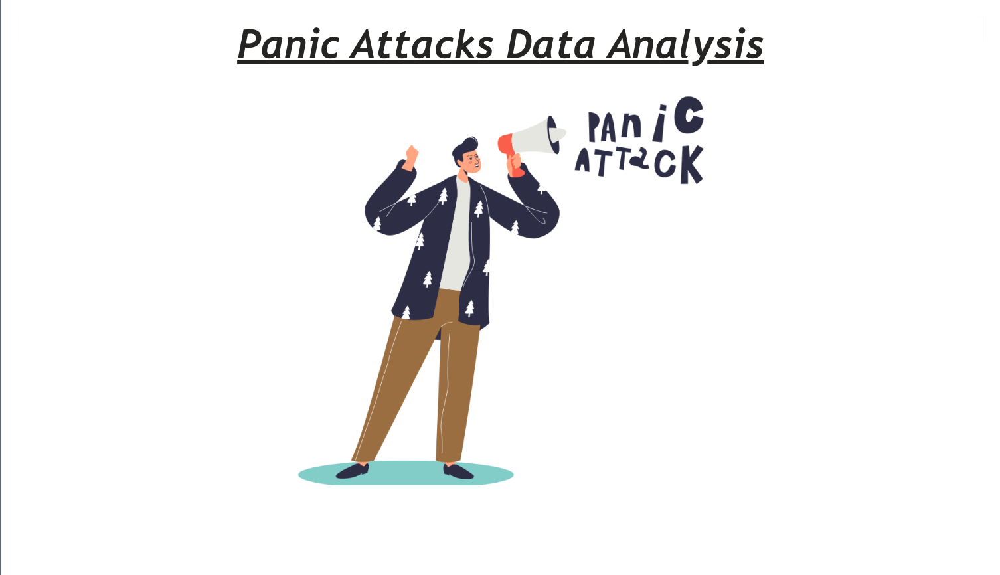
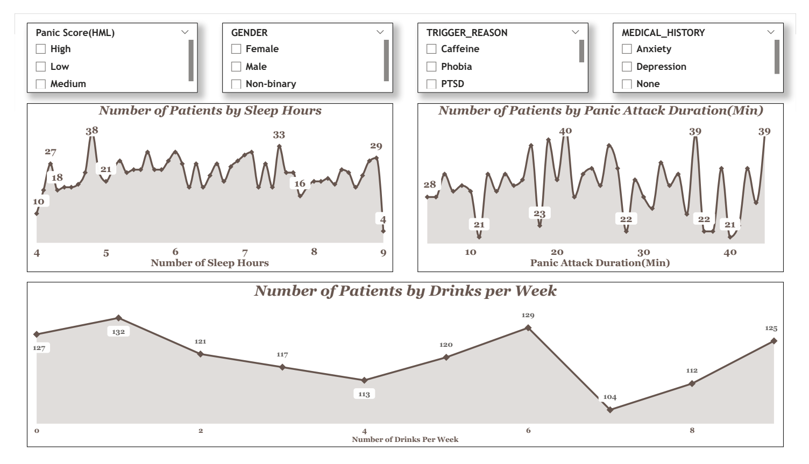
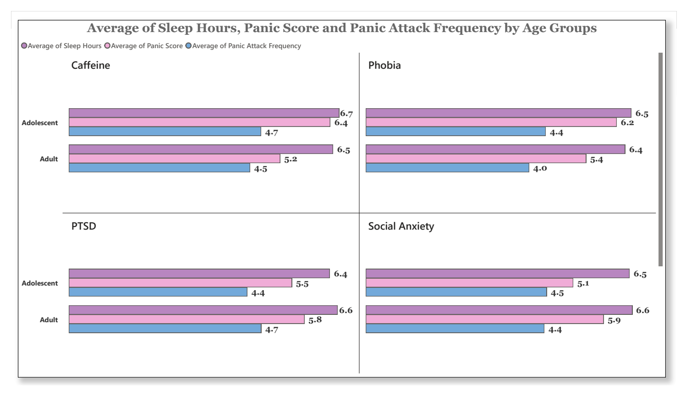

# Panic Attacks Data Analysis
Power BI | Snowflake | SQL | DAX | Data Analytics

## Project Summary
End-to-end data analysis project focused on understanding panic attack patterns, symptoms, and contributing factors using structured healthcare-related data stored in Snowflake and analyzed in Power BI.

The project explores relationships between demographics, symptoms, lifestyle factors, and panic severity to support data-driven insights into mental health trends.

### Tools & Technologies
- Power BI Desktop & Power BI Service
- Snowflake (Cloud Data Warehouse)
- SQL (Data Exploration & Validation)
- Power Query (ETL & Data Transformation)
- DAX (IF, SWITCH, COUNTROWS, FILTER, DIVIDE)

### Data Source
- Panic attack dataset loaded into Snowflake
- Source file: panic_attack_dataset.csv
- Data includes demographics, symptoms, lifestyle habits, and panic severity scores

### Key Responsibilities
- Created and managed database and tables in Snowflake
- Loaded and validated data using SQL queries
- Connected Snowflake to Power BI for analysis
- Cleaned and transformed data using Power Query
- Standardized boolean and numeric fields for analysis
- Created calculated columns and measures using DAX
- Designed multi-page interactive Power BI dashboards
- Published reports to Power BI Service

### Key Metrics & Analysis
- Panic attack frequency and duration analysis
- Panic severity categorization (Low / Medium / High)
- Symptom occurrence analysis (dizziness, sweating, chest pain, trembling, shortness of breath)
- Lifestyle factor analysis (sleep hours, alcohol consumption, exercise, caffeine intake)
- Age group segmentation (Child, Adolescent, Adult, Senior)
- Percentage of patients experiencing specific symptoms

### Dashboard Highlights
- Overview page for panic attack analysis
- Symptom-based patient distribution dashboards
- Interactive slicers for panic score, gender, trigger reason, and medical history
- Age group analysis with lifestyle and severity comparison
- Consistent visual theme across all report pages

## How to Use the Dashboard
- Use slicers to filter by panic severity, age group, gender, and trigger reason
- Navigate across Overview, Lifestyle, Age Group, and Symptoms pages
- Hover over visuals to view detailed values and comparisons

## Report Snapshot (Power BI Desktop)

### Panic Attacks Overview Dashboard

### Symptoms Analysis Dashboard

### Lifestyle & Severity Analysis Dashboard

### Age Group Analysis Dashboard

### Business Insights
- Identified common symptoms strongly associated with higher panic scores
- Highlighted lifestyle factors linked to increased panic severity
- Age group analysis revealed distinct panic patterns across demographics
- Symptom frequency analysis supports targeted mental health insights

### Outcome
Delivered a production-ready Power BI dashboard that enables interactive exploration of panic attack data and supports analytical understanding of mental health patterns using cloud-based data.

### Skills Demonstrated
- Data Analysis & Visualization
- Cloud Data Warehousing (Snowflake)
- SQL & Data Validation
- Data Cleaning & Transformation (ETL)
- DAX Calculations
- Analytical Storytelling

## Data Ethics & Disclaimer
This project uses a synthetic / anonymized dataset for educational and analytical purposes only.  
It does not represent real patient data and should not be used for medical diagnosis.
